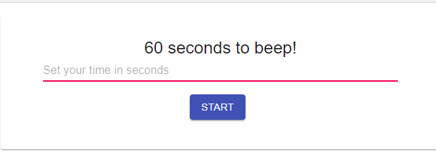

# Beeptime 
Time flies while we're concentrated, so, we cannot be concious about the elapsed time. This app beeps during a certain period of time, thus avoid checking the clock and therefore "lose the flow".  
### Views: 
- Home view. In there, we could set the time period.


## Built With

- Js,
- React,
- MaterialUI

## Getting Started

To get a local copy up and running follow these simple steps.

### Prerequisites
- Code editor
- Node

### Setup
Clone the repo with `git clone https://gitlab.com/inorbit/exercise-miniorbit-frontend-barbara.git`

### Running

- `npm start` — This will spawn a development server with a default port of `1234`.
- `npm run build` — This will output a production build in the `dist` directory.

## Custom port

You can use the `-p` flag to specify a port for development. To do this, you can either run `npm start` with an additional flag:

```
npm start -- -p 3000
```

Or edit the `start` script directly:

```
parcel index.html -p 3000
```

## Live Demo

Check it out [here](https://beeptime.netlify.app/)

## Coming Soon
- Quick notes panel
- Dark theme
## Authors

**Barbara Martinez**

- Github: [@bmartin2013](https://github.com/bmartin2013)
- 🤝🏻LinkedIn: [@barmartinezc](https://www.linkedin.com/in/barmartinezc/)
- 📫Mail: barmartinezc@gmail.com

## Show your support

Give a ⭐️ if you like this project!